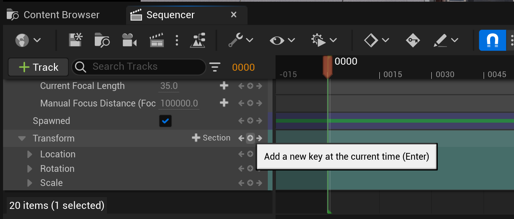
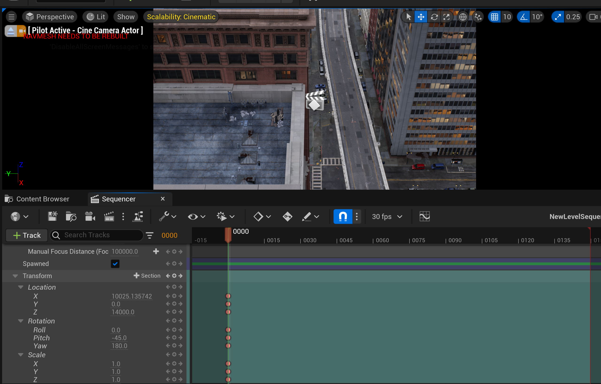
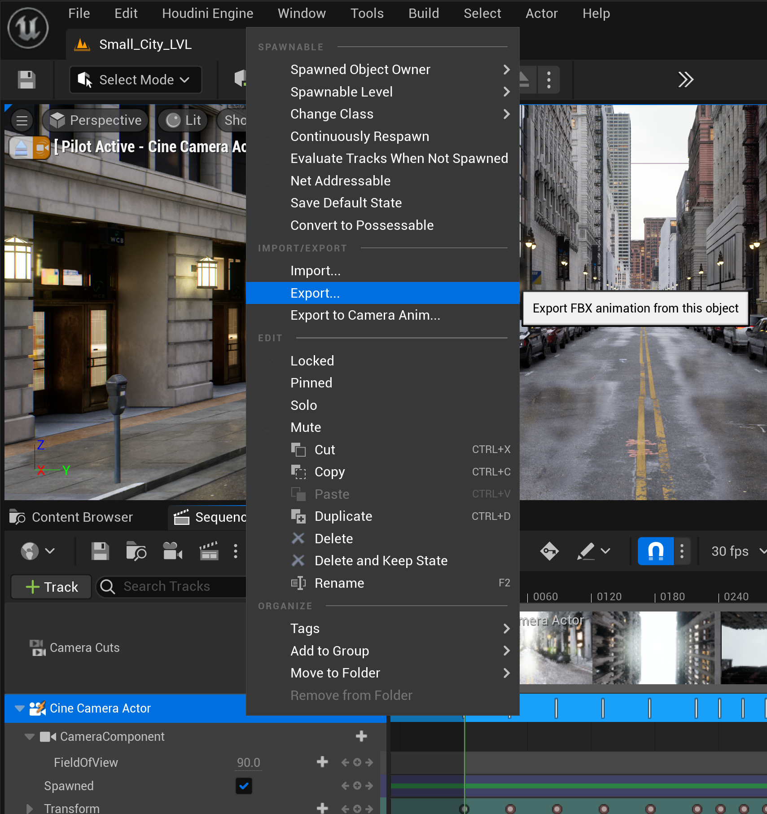
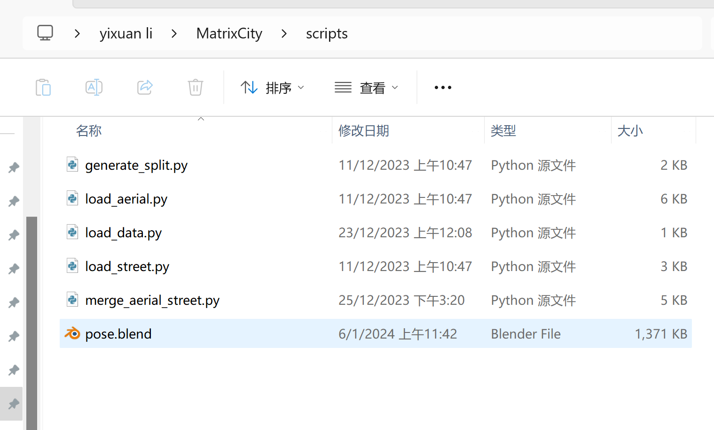
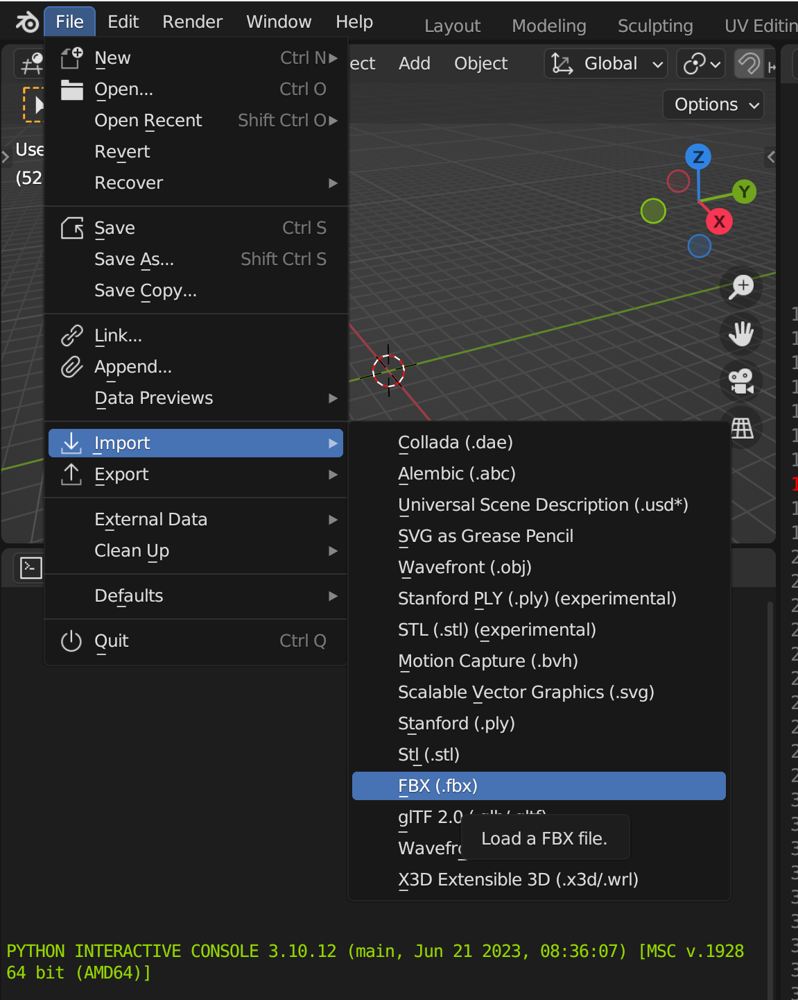
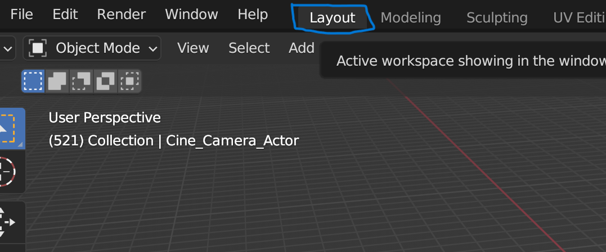
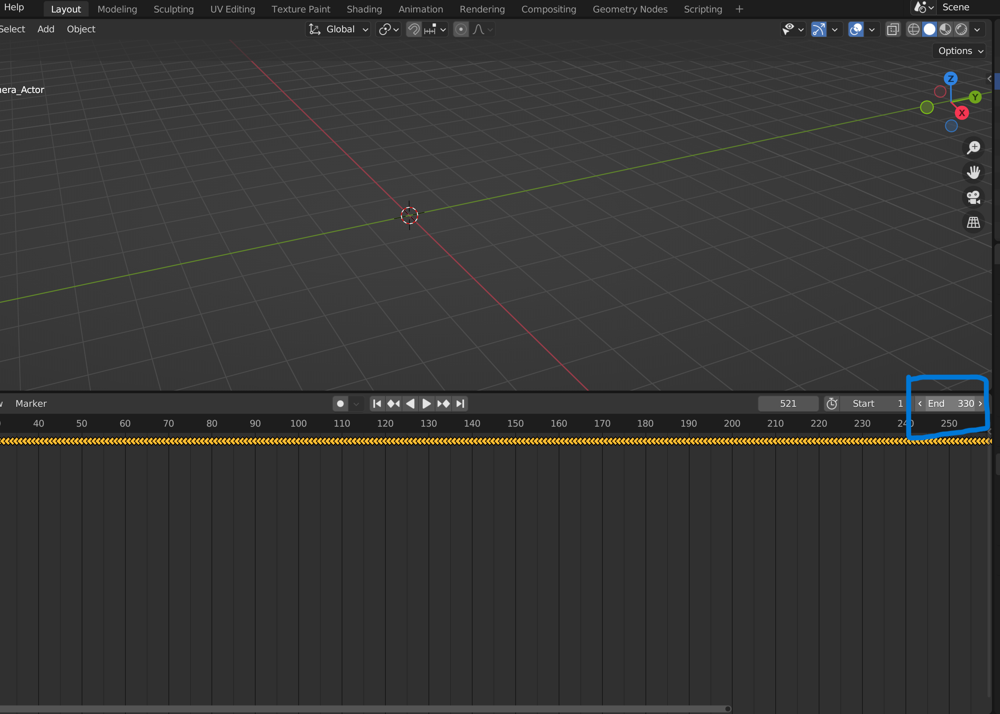
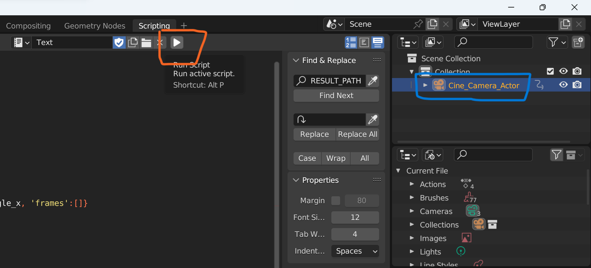

# Generate Custom Trajectory

## Create a New UE project.

### 0. download the plugin 
Download MatrixCityPlugin from our github repo. And put the `MatrixCityPlugin` folder into the foler `Plugins` of your new ue project.

### 1. set config

Modify config in [misc/user.json](../misc/user.json):

- `ue_command`: refers to the path of `UnrealEditor-Cmd.exe`.
- `ue_project`: refers to the path of your project with suffix of `.uprojcet`.
- `render_config`: refers to the path of render config you defined in `.yaml` 
(an example definition is in [misc/render_config_common.yaml](../misc/render_config_common.yaml)).
- `python_script`: refers to the path of python script you want to execute.

### 2. init the plugin (Optional)
If you have already installed the plugin for `City Sample Project`, you can skip this step.

You can run the command below to install all the dependencies.

```bash
python misc/run_init.py -f misc/user.json
```

This script would execute the following steps:

- `pip install -r misc/requirements_ue.txt` for ue python.

- `pip install -r misc/requirements.txt` for system python.

## Run from python
You can run the command below to generate custom trajectories. The generated trajectories (.uasset) are stored in the foler `[Your Proejct]\Content\Sequences`. The generated camera trajectories can be rendered in any UE 5 project. If any error happens, you can refer to `[Your Project]\Saved\Logs\Pipeline.log` for detailed information by finding `error`. 

**Note that the first running requires compiling the shaders, which will take a long time. City sample takes longer, so we start a new project to quickly generate camera trajectories and render these trajectories in City Sample under different environmental settings manually.**

```bash
python misc/run_cmd_async.py
```
We provide the examples for generating training and testing set for aerial data, and generating training(sparse/dense) and testing set for street data in the `main` function of [Content/Python/utils_sequencer.py](../Content/Python/utils_sequencer.py)


- `generate_train_box` and `generate_test_box`: Generate camera trajectories for aerial data, given `line1`, `line2`, `height` and `current_frame`. Each capturing location in the collection box has four cameras, with each camera rotating 90◦ apart from each other in the yaw direction and identical pitch values.
    - In your project map, please annotate the boundary of the collection box and retrieve the `line1`, `line2`, and `height` values from the Unreal Engine (UE). Note that `line1` and `line2` represent two edges of the rectangle, which are parallel and oriented in the same direction.
- `generate_train_line` and `generate_test_line`: Generate camera trajectories for street data, given `point1`, `point2`, `height`, `yaw`, `current_frame`, `dense`. Each capturing location in the collection lines has six perspective cameras to render a cube map, providing a comprehensive view of the surroundings. But, we remove the images that look straight down following [nerfstudio](https://docs.nerf.studio/quickstart/custom_dataset.html#data-equirectangular). These two functions support generate the trajectories of multiple streets in one sequence.
    - In your project map, please annotate the start and end points of the collection line and retrieve the `point1`, `point2`, `height`, and `yaw` values from the Unreal Engine (UE). Note that `point1` and `point2` represent endpoints of the line, `yaw` represents the direction of the line, and `dense` controls the collection frequency (1m / 5m).
- How to annotate keypoints and retrieve corresponding camera pose in UE:
    #### 1. Create a level sequence to record camere poses.
    

    #### 2. Add a new camera.
    

    #### 3. Lock camera to current viewport to ensure that the preview in the viewport is consistent with the camera image.
    

    #### 4. Use the up, down, left and right keys to control camera movement. And use the right mouse button to control the camera direction. If you want to annotate current camera pose, you can add a new key in the `transform` part.
    

    #### 5. Retrieve the camera pose. You can also modify the camera poses by modifying the values in `transform`, thereby changing the preview in the viewport to achieve the desired picture.
    
    
    #### 6. Move to next frame to annotate next keypoint. Repeat step 4-6.
    

### Note:
- You need to specify the `sequence name`, `fov`, and the trajectory generation function and corresponding parameters in the `main` function of [Content/Python/utils_sequencer.py](../Content/Python/utils_sequencer.py) like the given examples to generate your own trajectories.
- The fov is 45 for aerial data and 90 for street data.
- You can add your own tracjectory generation functions in the file [Content/Python/utils_sequencer.py](../Content/Python/utils_sequencer.py) and call it in the `main` function.

## Export Camera Poses

### 1. Install `Blender`
### 2. Export camera poses from UE project
- Right click on the cine camera actor of the sequence and select `Export...`.


- There is no need to modify the settings, just select `Export`.


- Read the index `N` of the last frame from the sequence or from the rendered image. For the following example, `N` is 329


### 3. Transform camera poses in Blender
- Double-click [pose.blend](../../scripts/pose.blend) to open it in Blender.


- Import the fbx file exported from UE.


- If you import successfully, you will see `Cine_Camera_Actor`.


- Select `Layout` to change the `End` with `N+1` (`N` is the index of the last frame of the sequence).



- Select `Script` and change the `fp` to your local directory.


- Select `Cine_Camera_Actor` and click the `Run` icon. `transforms.json` will be saved in `fp`. The unit of position is m. And the rotaton matrix needs to be multiplied by 100 to normalize it. You can use [generate_split.py](../../scripts/generate_split.py) to generate files for training. 
